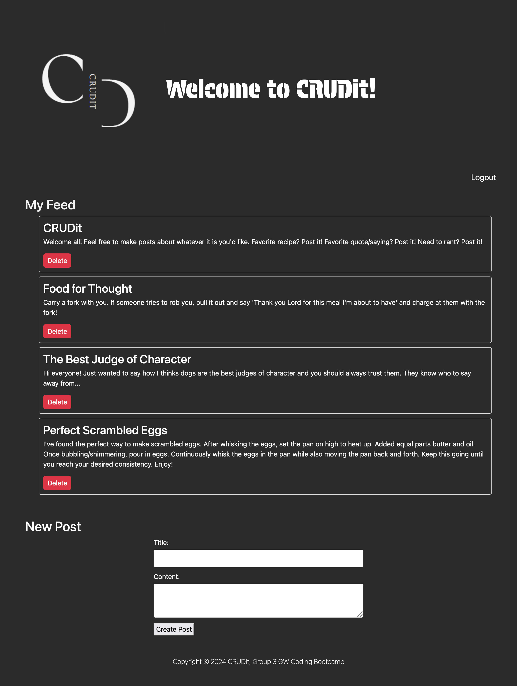

# crudit
Group Project 2


## Description
CRUDit is a blog-type website which allows registered users to create, read, update, and delete posts.


## User Story
```
AS A user
I WANT to be able to create posts about various topics
SO THAT I can post about things I want to share and see what others have to share as well
```


## Acceptance Criteria
```
GIVEN I am looking for a website where I can create posts and read other peoples posts
WHEN I visit the webpage
THEN I am presented with a landing page that directs me to log in or sign up
WHEN I log in or sign up
THEN I am able to see the latest posts
WHEN I click on "Submit" after entering a title and content
THEN my post appears in the main feed
WHEN I click "Delete"
THEN the post will be deleted
WHEN I log out
THEN I am logged out and can no longer see posts
```




Live application: 